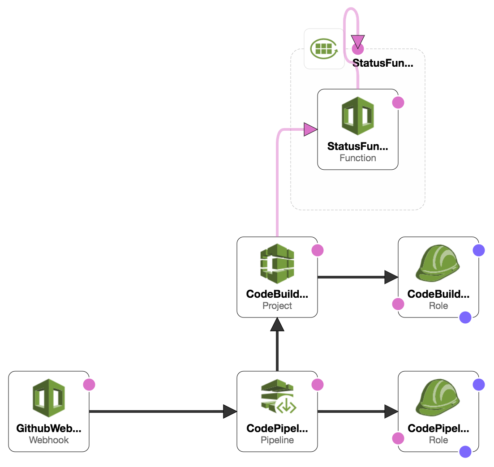

# CodePipeline → Lambda → Github
> Update a GitHub commit status via CodePipeline events

[](https://github.com/mrz1836/codepipeline-to-github/releases)
[](https://codecov.io/gh/mrz1836/codepipeline-to-github)
[](https://travis-ci.com/mrz1836/codepipeline-to-github)
[](https://goreportcard.com/report/github.com/mrz1836/codepipeline-to-github)
[](https://golang.org/)
[](https://github.com/sponsors/mrz1836)
[](https://mrz1818.com/?tab=tips&af=codepipeline-to-github)

<br/>

## Table of Contents
- [TL;DR](#tldr)
- [Installation](#installation)
- [Deployment & Hosting](#deployment--hosting)
- [Documentation](#documentation)
- [Examples & Tests](#examples--tests)
- [Code Standards](#code-standards)
- [Maintainers](#maintainers)
- [Contributing](#contributing)
- [License](#license)

<br/>

## TL;DR
[AWS CodePipeline](https://aws.amazon.com/codepipeline/) lacks an easy way to update Github commit statuses _(at this time)_. Launch this serverless application and 
immediately start updating commits as pipeline events occur. All you need is a [Github personal access token](https://help.github.com/en/github/authenticating-to-github/creating-a-personal-access-token-for-the-command-line) and some [AWS credentials](#prerequisites).

<br/>

## Installation

#### Prerequisites
- [An AWS account](https://aws.amazon.com/) 
    - _Running functions locally_ requires permission to: [CodePipeline](https://aws.amazon.com/kms/) and [KMS](https://aws.amazon.com/kms/)
    - _Deploying_ requires permission to: [KMS](https://aws.amazon.com/kms/), [SSM](https://aws.amazon.com/systems-manager/features/), [Secrets Manager](https://aws.amazon.com/secrets-manager/) and [Cloud Formation](https://aws.amazon.com/cloudformation/)
- [AWS CLI](https://docs.aws.amazon.com/cli/latest/userguide/installing.html) _(`brew install awscli`)_
- [Golang](https://golang.org/doc/install) _(`brew install go`)_
- [SAM CLI](https://docs.aws.amazon.com/serverless-application-model/latest/developerguide/serverless-sam-cli-install-mac.html) _(`brew tap aws/tap && brew install aws-sam-cli`)_
    - Running functions locally requires: [Docker](https://docs.docker.com/install)

Clone or [go get](https://golang.org/doc/articles/go_command.html) the files locally
```shell script
go get github.com/mrz1818/codepipeline-to-github
cd $GOPATH/src/github.com/mrz1818/codepipeline-to-github
```

<details>
<summary><strong><code>Setup to run locally</code></strong></summary>
<br/>

**1)** Modify the [event json](events/started-event.json) to a recent pipeline execution and pipeline name
```json
"detail": {
  "pipeline": "your-pipeline-name",
  "execution-id": "some-execution-id"
}
```

**2)** Modify the [local-env.json](local-env.json) file with your Github Personal Access Token
```json
"StatusFunction": {
  "GITHUB_ACCESS_TOKEN": "your-token-goes-here"
}
``` 

**3)** Finally, run the handler which should produce `null` and the commit status should be updated
```shell script
make run event="started"
``` 
</details>

<br/>

## Deployment & Hosting
This repository has CI integration using [AWS CodePipeline](https://aws.amazon.com/codepipeline/).

Deploying to the `master` branch will automatically start the process of shipping the code to [AWS Lambda](https://aws.amazon.com/lambda/).

Any changes to the environment via the [AWS CloudFormation template](application.yaml) will be applied.
The actual build process can be found in the [buildspec.yml](buildspec.yml) file.

The application relies on [AWS Secrets Manager](https://aws.amazon.com/secrets-manager/) 
and [AWS SSM](https://aws.amazon.com/systems-manager/features/) to store environment variables. 
Sensitive environment variables are encrypted using [AWS KMS](https://aws.amazon.com/kms/) and then decrypted at runtime.

Deploy different environments by changing the `<stage>` to `production` or `developement` as example.
The default stage is `production` if you do not specified.

<details>
<summary><strong><code>Create Environment Encryption Key(s) (AWS)</code></strong></summary>
<br/>

Create a `KMS Key` per `<stage>` for your application(s) to encrypt environment variables
```shell script
make create-env-key APPLICATION_STAGE_NAME="<stage>"
```

This will also store the `kms_key_id` in  [SSM](https://aws.amazon.com/systems-manager/features/): `/<application>/<stage>/kms_key_id` 

</details>

<details>
<summary><strong><code>Manage Environment Secrets (AWS)</code></strong></summary>
<br/>

The `Github token` is stored encrypted for use in Lambda (decrypted at runtime via [KMS](https://aws.amazon.com/kms/).

Add or update your Github personal access token
```shell script
make save-secrets token="YOUR_GITHUB_TOKEN"  kms_key_id="YOUR_KMS_KEY_ID"  APPLICATION_STAGE_NAME="<stage>"
```
</details>

<details>
<summary><strong><code>Create New CI & Hosting Environment (AWS)</code></strong></summary>
<br/>



This will create a new [AWS CloudFormation](https://aws.amazon.com/cloudformation/) stack with:
- (1) [Lambda](https://aws.amazon.com/lambda/) Function(s)
- (1) [CloudWatch Event Rule](https://docs.aws.amazon.com/AmazonCloudWatch/latest/events/Create-CloudWatch-Events-Rule.html) to subscribe to Pipeline events
- (1) [CloudWatch LogGroups](https://aws.amazon.com/cloudwatch/) for Lambda Function(s)
- (1) [CodePipeline](https://aws.amazon.com/codepipeline/) with multiple stages to deploy the application from Github
- (1) [CodePipeline Webhook](https://aws.amazon.com/codepipeline/) to receive Github notifications from a specific `branch:name`
- (1) [CodeBuild Project(s)](https://docs.aws.amazon.com/codebuild/latest/userguide/create-project.html) to test, build and deploy the app
- (2) [Service Roles](https://docs.aws.amazon.com/IAM/latest/UserGuide/id_roles_create_for-service.html) for working with CodeBuild and CodePipeline

**NOTE:** Requires an existing S3 bucket for artifacts and sam-cli deployments (located in the [Makefile](Makefile))

One command will build, test, package and deploy the application to AWS. 
After initial deployment, updating the function is as simple as committing to Github.
```shell script
make deploy
```

_(Example)_ Customized deployment for another stage/branch
```shell script
make deploy APPLICATION_STAGE_NAME="development" REPO_BRANCH="development"
``` 

If you make any adjustments to the command above, update the [buildspec](buildspec.yml) file accordingly.  
</details>

<details>
<summary><strong><code>Tear Down CI & Hosting Environment (AWS)</code></strong></summary>
<br/>

Remove the Stack(s)
```shell script
make teardown
```   

_(Example)_ Teardown another stage
```shell script
make teardown APPLICATION_STAGE_NAME="development"
``` 
</details>

<details>
<summary><strong><code>Lambda Logging</code></strong></summary>
<br/>

View all the logs in [AWS CloudWatch](https://console.aws.amazon.com/cloudwatch/home?region=us-east-1#logsV2:log-groups) via log groups:
```text
/aws/lambda/<app_name>-<stage_name>
```
</details>

<br/>

## Documentation
The [`status`](status.go) handler does the following:
```text
- Processes incoming CloudWatch events from CodePipeline
- Decrypts environment variables (Github Token)
- Gets the latest information from CodePipeline via an ExecutionID
- Determines the Github status based on the Execution status
- Initiates a http/post request to Github to update the commit status
``` 

Run the status function with different pipeline [events](events)
```shell script
make run event="failed"
``` 

<details>
<summary><strong><code>Release Deployment</code></strong></summary>
<br/>

[goreleaser](https://github.com/goreleaser/goreleaser) for easy binary or library deployment to Github and can be installed via: `brew install goreleaser`.

The [.goreleaser.yml](.goreleaser.yml) file is used to configure [goreleaser](https://github.com/goreleaser/goreleaser).

Use `make release-snap` to create a snapshot version of the release, and finally `make release` to ship to production.
</details>

<details>
<summary><strong><code>Makefile Commands</code></strong></summary>
<br/>

View all `makefile` commands
```shell script
make help
```

List of all current commands:
```text
all                            Run lint, test and vet
bench                          Run all benchmarks in the Go application
build                          Build the lambda function as a compiled application
clean                          Remove previous builds, test cache, and packaged releases
clean-mods                     Remove all the Go mod cache
coverage                       Shows the test coverage
create-env-key                 Creates a new key in KMS for a new stage
create-secret                  Creates an secret into AWS SecretsManager
decrypt                        Encrypts data using a KMY Key ID
deploy                         Build, prepare and deploy
encrypt                        Encrypts data using a KMY Key ID
godocs                         Sync the latest tag with GoDocs
help                           Show all commands available
lambda                         Build a compiled version to deploy to Lambda
lint                           Run the Go lint application
package                        Process the CF template and prepare for deployment
release                        Full production release (creates release in Github)
release-test                   Full production test release (everything except deploy)
release-snap                   Test the full release (build binaries)
run                            Fires the lambda function (IE: run event=started)
save-param                     Saves a plain-text string parameter in SSM
save-param-encrypted           Saves an encrypted string value as a parameter in SSM
save-secrets                   Helper for saving Github token(s) to Secrets Manager (extendable for more secrets)
tag                            Generate a new tag and push (IE: tag version=0.0.0)
tag-remove                     Remove a tag if found (IE: tag-remove version=0.0.0)
tag-update                     Update an existing tag to current commit (IE: tag-update version=0.0.0)
teardown                       Deletes the entire stack
test                           Runs vet, lint and ALL tests
test-short                     Runs vet, lint and tests (excludes integration tests)
test-travis                    Runs tests via Travis (also exports coverage)
update                         Update all project dependencies
update-releaser                Update the goreleaser application
update-secret                  Updates an existing secret in AWS SecretsManager
vet                            Run the Go vet application
```
</details>

<br/>

## Examples & Tests
All unit tests run via [Travis CI](https://travis-ci.org/mrz1836/codepipeline-to-github) and uses [Go version 1.14.x](https://golang.org/doc/go1.14). View the [deployment configuration file](.travis.yml).

Run all tests (including integration tests)
```shell script
make test
```

<br/>

## Code Standards
Read more about this Go project's [code standards](CODE_STANDARDS.md).

<br/>

## Maintainers

| [](https://github.com/mrz1836) |
|:---:|
| [MrZ](https://github.com/mrz1836) |

<br/>

## Contributing

View the [contributing guidelines](CONTRIBUTING.md) and follow the [code of conduct](CODE_OF_CONDUCT.md).

### How can I help ?
All kinds of contributions are welcome :raised_hands:! 
The most basic way to show your support is to star :star2: the project, or to raise issues :speech_balloon:. 
You can also support this project by [becoming a sponsor on GitHub](https://github.com/sponsors/mrz1836) :clap: 
or by making a [**bitcoin donation**](https://mrz1818.com/?tab=tips&af=codepipeline-to-github) to ensure this journey continues indefinitely! :rocket:

### Credits
This application would not be possible without the work provided in these repositories: 
- [CPLiakas's SAM Golang Example](https://github.com/cpliakas/aws-sam-golang-example) 
- [InfoPark's Github Status](https://github.com/infopark/lambda-codepipeline-github-status)
- [Jenseickmeyer's Commit Status Bot](https://github.com/jenseickmeyer/github-commit-status-bot) 
- [Rowanu's SAM Golang Starter](https://github.com/rowanu/sam-golang-starter) 

<br/>

## License


